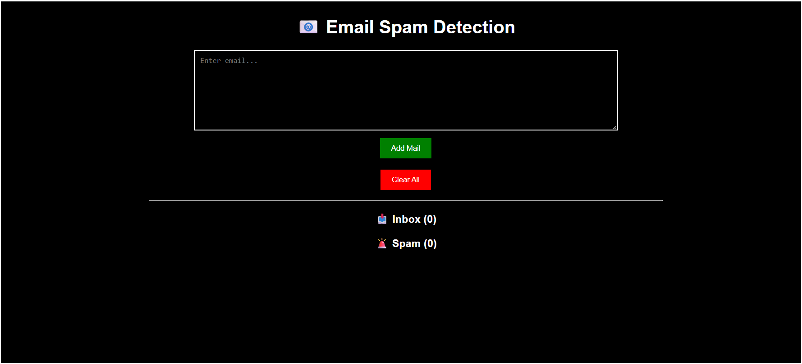

# 📩 Email/SMS Spam Classifier | OIBSIP Task 3

> 💡 A Machine Learning-based web application that classifies messages as Spam or Not Spam using Natural Language Processing (NLP).

---

## 📸 Application Preview



---

## ✨ Key Highlights

✔ 📩 Detect spam messages instantly
✔ 🧠 NLP-based text processing
✔ ⚡ Fast and accurate predictions
✔ 🌐 Interactive Flask web app
✔ 🎨 Clean and simple UI

---

## 🧠 How It Works

This application uses **Natural Language Processing (NLP)** techniques along with a trained Machine Learning model to classify messages.

### Steps involved:

* Text cleaning (removing punctuation, stopwords)
* Tokenization
* Feature extraction using **TF-IDF Vectorization**
* Prediction using trained ML model

---

## 📥 Input

* ✍️ **User message (text input)**

---

## 📤 Output

* 📩 **Spam** or **Not Spam**

---

## 🤖 Machine Learning Details

* 📌 Model: Naive Bayes Classifier
* 📊 Technique: TF-IDF Vectorization
* 📚 Dataset: SMS Spam Collection Dataset

---

## 🛠️ Tech Stack

| Technology        | Purpose            |
| ----------------- | ------------------ |
| 🐍 Python         | Backend logic      |
| 🌐 Flask          | Web framework      |
| 🤖 Scikit-learn   | ML model           |
| 📊 Pandas & NumPy | Data processing    |
| 🧠 NLTK           | Text preprocessing |
| 🎨 HTML/CSS       | Frontend UI        |

---

## 📦 Requirements

Install dependencies using:

```bash
pip install -r requirements.txt
```

Or manually:

```bash
pip install flask pandas numpy scikit-learn nltk
```

---

## 🚀 Run Locally

```bash
# Navigate to folder
cd Task3_Spam_predictor

# Run app
python app.py
```

👉 Open in browser:
http://127.0.0.1:5000/

---

## 📁 Project Structure

```
Task3_Spam_predictor/
│
├── app.py
├── model.pkl
├── vectorizer.pkl
├── requirements.txt
├── screenshot.png
│
├── static/
│   └── style.css
│
├── templates/
│   └── index.html
│
└── README.md
```

---

## 🎯 Project Objective

To build an intelligent system that can:

* Detect spam messages
* Apply NLP techniques for text classification
* Demonstrate real-world ML deployment

---

## 🚀 Future Improvements

🔹 Add deep learning models (LSTM, BERT)

🔹 Improve accuracy with larger datasets

🔹 Deploy application online (Render / Railway / AWS)

🔹 Add multilingual support

🔹 Integrate with email/SMS systems

---

## 👨‍💻 Author

**Sumit Tiwari**
📍 Bangalore, Karnataka
🎓 B.Tech Computer Science (2025)
📧 [sumittiwari62642004@gmail.com](mailto:sumittiwari62642004@gmail.com)

---

## 📌 Acknowledgement

This project was completed as part of the **Oasis Infobyte Data Science Internship (OIBSIP)**.

---

## ⭐ Support

If you found this project helpful, please ⭐ star the repository!
